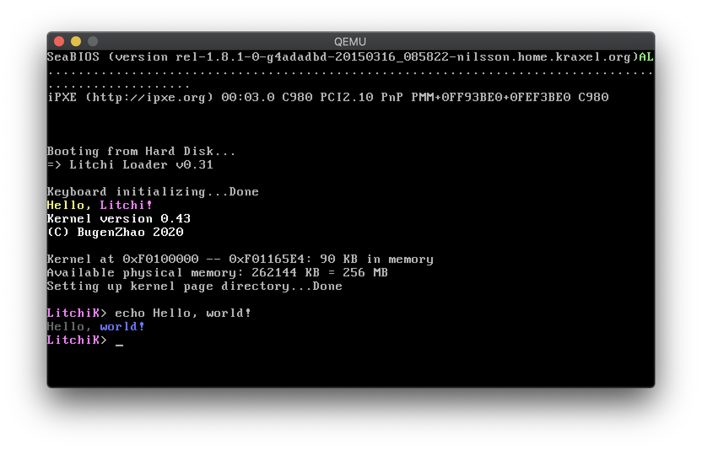

# Litchi
Bugen's toy kernel for i386 systems implemented in C, with full of comments.   
Now at **_very early_** development stage.  

## Progress
- [x] Adopt bootloader from JOS / xv6
- [ ] Bootloader support for floppy drive
- [x] Port old Litchi codes
- [x] CMake build support
- [x] Kernel level standard output
- [x] Color output in console
- [x] Serial port color output
- [ ] Serial port input
- [x] Kernel panic and warning
- [x] Programmed keyboard input support
- [x] Kernel level standard input
- [ ] Input with format
    - [x] `stringToLong`
    - [ ] `scanFmt`
- [x] Basic debugging information
- [ ] Basic kernel commands
    - [x] `help`
    - [x] `echo`
    - [x] `vm-*`
        - [x] `map`
        - [x] `dump`
    - [ ] `...`
- [x] Physical memory detection
- [x] Physical memory management
- [x] Virtual memory
- [x] Kernel address space
- [ ] Kernel heap management
---
- [ ] Test for standard library
- [ ] Interrupt based keyboard input
- [ ] User level environment
- [ ] Process
- [ ] Shell
- [ ] Multitasking
- [ ] Multi-core support
- [ ] Switch to x86-64
- [ ] ...

## Reference
1. [JOS / xv6](https://pdos.csail.mit.edu/6.828/2018/schedule.html)
2. [Stack Overflow](https://stackoverflow.com)
3. [Hurlex](http://hurlex.0xffffff.org)
4. [Orange'S: 一个操作系统的实现](https://book.douban.com/subject/3735649/)
5. [OSDev.org](https://wiki.osdev.org)
